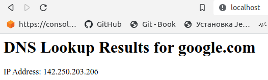
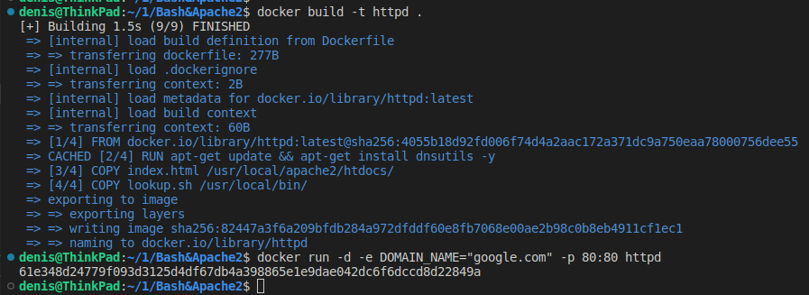

Устанавливается пакет dnsutils, который содержит утилиту nslookup, используемую в скрипте.  
Копируется скрипт script.sh внутрь контейнера в /usr/local/bin/.    
Устанавливается переменная окружения ARGUMENTS со значением по умолчанию "" (пустая строка).    
Копируется index.html внутрь контейнера в /usr/local/apache2/htdocs/.   
В команде CMD запускается скрипт с передачей значения переменной окружения ENV в качестве аргументов, а затем запускается httpd-foreground для запуска Apache httpd сервера.    
Запуск контейнера
```sh
docker run -e DOMAIN_NAME="google.com" -p 8080:80 my-httpd
```


